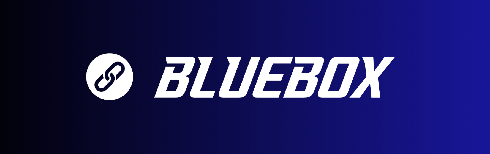
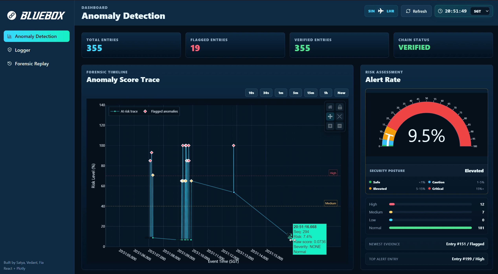
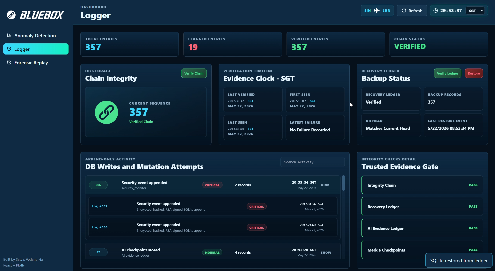

<p align="center">
  
</p>

<br>

<p align="center">
  <a href="#quick-start-on-windows"></a>
  <a href="#quick-start-on-linux-or-macos"></a>
  
  
  
  <a href="LICENSE.md"></a>
  <a href="SECURITY.md"></a>
</p>

<p align="center">
  
  
  
  
  
  
  
  
  
</p>

<p align="center">
  <a href="#features">Features</a> |
  <a href="#toolchain">Toolchain</a> |
  <a href="#repository-structure">Directory Structure</a> |
  <a href="#demo-run">Demo</a> |
  <a href="docs_md/provenance_graph.md">Provenance Graph</a> |
  <a href="SECURITY.md">Security</a>
</p>

<br>

## BlueBox

BlueBox is an AI-assisted, tamper-evident flight recorder demo for connected aircraft systems. It generates aircraft-style traffic, detects suspicious behavior, stores evidence in a signed hash-chain logger, and gives analysts a dashboard for anomaly triage, forensic replay, provenance graph review, and Part-IS response guidance.

This repository is designed for Airbus-focused local demos and controlled internal evaluation. It is not an open-source distribution and should not be reused, copied, or shared outside the authorised project context.

## Features

BlueBox demonstrates three main dashboard capabilities:

1. **Anomaly Detection**
   - Streams scored aircraft network and ARINC 429 evidence.
   - Highlights suspicious packet size, frequency, protocol, port, cross-domain, replay, command, and ARINC field behavior.
   - Shows AI explanations such as top SHAP features and anomaly reasons.

<br>

<br>

2. **Trusted Logger and Recovery**
   - Stores every raw evidence row in encrypted SQLite.
   - Links entries with hashes, RSA signatures, anchors, and recovery ledgers.
   - Blocks normal dashboard reads when trust verification fails.
   - Demonstrates blocked tamper attempts and recovery from forced corruption.
  
<br>

<br>

3. **Forensic Replay, Provenance Graph, and BB Chat**
   - Replays evidence in sequence order.
   - Shows source, target, severity, graph links, chain events, and DB mutation attempts.
   - Lets analysts upload regulation documents for BB Chat RAG.
   - Answers sequence-specific and incident-response questions with EU Part-IS aligned steps.

<br>

<br>

## Toolchain

| Area | Tools and libraries |
|---|---|
| Frontend dashboard | React 18, Vite, Tailwind CSS, D3.js, Plotly.js, Zustand, Axios, Lucide icons |
| Backend API | Python, ThreadingHTTPServer, SQLite, JSON APIs |
| AI and analytics | scikit-learn, SHAP, NumPy, pandas, NetworkX |
| Traffic generation | Scapy, YAML scenarios, PCAP, CSV, ARINC 429-style records |
| Evidence trust | AES-256-GCM payload protection, RSA signatures, hash chaining, anchors |
| Recovery | Recovery ledger, AI evidence ledger, Merkle-style checkpoints |
| BB Chat and RAG | Ollama, local evidence context, uploaded regulation documents, Part-IS templates |
| Reports and export | Forensic replay data, graph summary export, PNG export with Pillow |

## Project Governance

BlueBox is maintained as a private Airbus-focused project. Public contribution workflows are intentionally not included.

| Page | Purpose |
|---|---|
| [License](LICENSE.md) | Defines restricted proprietary use for this project |
| [Security](SECURITY.md) | Explains how to handle vulnerabilities, evidence, secrets, and internal reporting |

No public `CONTRIBUTING.md` or `CODE_OF_CONDUCT.md` is provided because this codebase is not intended for external reuse or community contribution.

## Repository Structure

```text
BlueBox/
|-- backend/                 # Data parsing, normalization, AI scoring, explanations, shared paths
|-- logger_layer/            # Hash-chain logger, evidence APIs, recovery logic, provenance graph builder
|-- UI_layer/
|   |-- app.py               # Optional UI entry point
|   |-- BB_bot/              # BB Chat service, RAG uploads, templates, conversation output
|   `-- bluebox_react/       # React dashboard source and production build
|-- demo/
|   |-- attack_scenarios/    # YAML scenarios for normal and attack traffic
|   `-- traffic_simulator.py # Traffic generator and live dashboard ingester
|-- docs_md/                 # Reference docs for architecture, schema, protocols, compliance, graph
|-- data/
|   |-- raw/                 # Source sample traffic
|   `-- derived/             # Generated normalized, scored, and explanation files
|-- models/                  # Trained model artifacts and statistics
|-- runtime/
|   |-- config/keys/         # Local demo keys, ignored by git
|   |-- evidence/            # SQLite evidence DB and generated demo traffic
|   `-- trust_boundary/      # Recovery ledger and AI evidence ledger
|-- requirements.txt         # Python dependencies
`-- readme.md                # This user manual
```

## Requirements

Install these before running BlueBox:

- Python 3.11 or newer
- Node.js 18 or newer
- npm
- Git
- Ollama, optional but recommended for BB Chat

Python packages are installed from `requirements.txt`. React packages are installed from `UI_layer/bluebox_react/package.json`.

## Quick Start on Windows

Run these commands from the repository root.

```powershell
py -3.11 -m venv bluebox-env
.\bluebox-env\Scripts\Activate.ps1
python -m pip install --upgrade pip
pip install -r requirements.txt
```

Build the dashboard:

```powershell
Push-Location .\UI_layer\bluebox_react
npm install
npm run build
Pop-Location
```

Optional BB Chat setup:

```powershell
ollama pull llama3.2:1b
ollama serve
```

In a second PowerShell window, check Ollama:

```powershell
Invoke-RestMethod http://127.0.0.1:11434/api/tags
```

Start the BlueBox API and dashboard server:

```powershell
.\bluebox-env\Scripts\python.exe .\logger_layer\api_server.py --host 127.0.0.1 --port 8080 --db .\runtime\evidence\sqlite\bluebox_log.db --recovery-ledger .\runtime\trust_boundary\recovery_ledger\bluebox_recovery.jsonl --ai-evidence-ledger .\runtime\trust_boundary\ai_evidence_ledger\bluebox_ai_evidence.jsonl
```

Open:

```text
http://127.0.0.1:8080
```

## Quick Start on Linux/MacOS

Run these commands from the repository root.

```bash
python3 -m venv bluebox-env
source bluebox-env/bin/activate
python -m pip install --upgrade pip
pip install -r requirements.txt
```

Build the dashboard:

```bash
cd UI_layer/bluebox_react
npm install
npm run build
cd ../..
```

Optional BB Chat setup:

```bash
ollama pull llama3.2:1b
ollama serve
```

In a second terminal, check Ollama:

```bash
curl http://127.0.0.1:11434/api/tags
```

Start the BlueBox API and dashboard server:

```bash
./bluebox-env/bin/python logger_layer/api_server.py --host 127.0.0.1 --port 8080 --db runtime/evidence/sqlite/bluebox_log.db --recovery-ledger runtime/trust_boundary/recovery_ledger/bluebox_recovery.jsonl --ai-evidence-ledger runtime/trust_boundary/ai_evidence_ledger/bluebox_ai_evidence.jsonl
```

Open:

```text
http://127.0.0.1:8080
```

## Demo Run

Keep the API server running in one terminal. In a second terminal, generate scored traffic and stream it into the dashboard.

Windows:

```powershell
.\bluebox-env\Scripts\python.exe .\demo\traffic_simulator.py --scenario mixed_attack --duration 1 --output-dir .\runtime\evidence\demo_output\standalone_mixed_attack --test
```

Linux or macOS:

```bash
./bluebox-env/bin/python demo/traffic_simulator.py --scenario mixed_attack --duration 1 --output-dir runtime/evidence/demo_output/standalone_mixed_attack --test
```

Refresh the dashboard if needed. The Anomaly Detection page should show scored rows, and Forensic Replay should show evidence records, graph nodes, and sequence details.

## Demo Attack Scenarios

Use `mixed_attack` for the main presentation.

```text
normal              Baseline traffic for comparison
mixed_attack        Main demo scenario covering all feature families
lateral_movement    Maintenance-to-avionics movement and scan behavior
command_injection   Control-command tampering and abnormal ARINC values
replay_attack       Duplicated or repeated command behavior
all                 Runs every kept scenario
```

Run all attack scenarios on Windows:

```powershell
.\bluebox-env\Scripts\python.exe .\demo\traffic_simulator.py --scenario mixed_attack --duration 1 --output-dir .\runtime\evidence\demo_output\standalone_mixed_attack --test
.\bluebox-env\Scripts\python.exe .\demo\traffic_simulator.py --scenario lateral_movement --duration 1 --output-dir .\runtime\evidence\demo_output\standalone_lateral_movement --test
.\bluebox-env\Scripts\python.exe .\demo\traffic_simulator.py --scenario command_injection --duration 1 --output-dir .\runtime\evidence\demo_output\standalone_command_injection --test
.\bluebox-env\Scripts\python.exe .\demo\traffic_simulator.py --scenario replay_attack --duration 1 --output-dir .\runtime\evidence\demo_output\standalone_replay_attack --test
```

Run all attack scenarios on Linux or macOS:

```bash
./bluebox-env/bin/python demo/traffic_simulator.py --scenario mixed_attack --duration 1 --output-dir runtime/evidence/demo_output/standalone_mixed_attack --test
./bluebox-env/bin/python demo/traffic_simulator.py --scenario lateral_movement --duration 1 --output-dir runtime/evidence/demo_output/standalone_lateral_movement --test
./bluebox-env/bin/python demo/traffic_simulator.py --scenario command_injection --duration 1 --output-dir runtime/evidence/demo_output/standalone_command_injection --test
./bluebox-env/bin/python demo/traffic_simulator.py --scenario replay_attack --duration 1 --output-dir runtime/evidence/demo_output/standalone_replay_attack --test
```

Run baseline normal traffic:

Windows:

```powershell
.\bluebox-env\Scripts\python.exe .\demo\traffic_simulator.py --scenario normal --duration 1 --output-dir .\runtime\evidence\demo_output\standalone_normal --test
```

Linux or macOS:

```bash
./bluebox-env/bin/python demo/traffic_simulator.py --scenario normal --duration 1 --output-dir runtime/evidence/demo_output/standalone_normal --test
```

## User Manual

### 1. Anomaly Detection

Use this page to answer: "What suspicious activity did the AI layer flag?"

What to check:

- Total evidence and anomaly counts
- High-severity rows
- Source and target IP addresses
- Protocol and port
- SHAP explanation themes
- Attack-family and verdict distribution charts

Good demo question:

```text
Which source IPs produced the highest severity anomalies?
```

### 2. Logger Control

Use this page to answer: "Can I trust this evidence?"

What to check:

- Chain verification status
- Recovery ledger verification
- AI evidence ledger verification
- Current head hash
- Anchor status
- Entry count and verified rows

Useful API checks:

Windows:

```powershell
Invoke-RestMethod http://127.0.0.1:8080/api/status
Invoke-RestMethod http://127.0.0.1:8080/api/anomaly
```

Linux or macOS:

```bash
curl http://127.0.0.1:8080/api/status
curl http://127.0.0.1:8080/api/anomaly
```

### 3. Forensic Replay and BB Chat

Use this page to answer: "What happened, how are events related, and what should the incident response be?"

What to check:

- Evidence stream sequence numbers
- Source and target values
- AI anomaly reasons
- Unified provenance graph
- DB mutation attempts
- Chain and recovery events
- BB Chat answers for sequence-specific questions

Useful BB Chat prompts:

```text
Explain what happened with sequence 356.
Which attack path is most critical?
Suggest incident response measures aligned with EU Part-IS.
What evidence should be preserved for reporting?
```

RAG document workflow:

1. Open Forensic Replay.
2. Upload EU Part-IS or regulation documents in the RAG Knowledge Base panel.
3. Ask BB Chat investigation or response questions.
4. Delete old uploaded documents from the same RAG panel when they are no longer needed.

If PDF text extraction is unavailable on your device, BlueBox still stores the file and uses built-in Part-IS response templates as fallback context.

## Tamper and Recovery Demo

These commands assume the API server is running.

### Blocked DB Mutation Attempts

Windows:

```powershell
Invoke-RestMethod -Method Post http://127.0.0.1:8080/api/tamper-attempt -ContentType "application/json" -Body '{"operation":"delete","actor":"203.0.113.45"}'
Invoke-RestMethod -Method Post http://127.0.0.1:8080/api/tamper-attempt -ContentType "application/json" -Body '{"operation":"update","actor":"203.0.113.45"}'
```

Linux or macOS:

```bash
curl -X POST http://127.0.0.1:8080/api/tamper-attempt -H "Content-Type: application/json" -d '{"operation":"delete","actor":"203.0.113.45"}'
curl -X POST http://127.0.0.1:8080/api/tamper-attempt -H "Content-Type: application/json" -d '{"operation":"update","actor":"203.0.113.45"}'
```

Expected result:

- The attempted delete or update is blocked by SQLite protection.
- The logger records a signed security event.
- Forensic Replay shows a DB mutation attempt.
- The provenance graph links attacker IP to the targeted sequence.

### Force Corruption and Restore

Use this only when you want to demonstrate recovery. It intentionally damages the local demo SQLite evidence store.

Windows:

```powershell
$loggerArgs = @(
  "-m", "logger_layer.hash_chain_logger",
  "--db", ".\runtime\evidence\sqlite\bluebox_log.db",
  "--recovery-ledger", ".\runtime\trust_boundary\recovery_ledger\bluebox_recovery.jsonl",
  "--ai-evidence-ledger", ".\runtime\trust_boundary\ai_evidence_ledger\bluebox_ai_evidence.jsonl"
)

.\bluebox-env\Scripts\python.exe @loggerArgs force-corrupt update --actor attacker-cli
.\bluebox-env\Scripts\python.exe @loggerArgs verify
.\bluebox-env\Scripts\python.exe @loggerArgs verify-ledger
.\bluebox-env\Scripts\python.exe @loggerArgs restore-ledger --reason forced_sqlite_corruption_demo --actor analyst
.\bluebox-env\Scripts\python.exe @loggerArgs verify
```

Linux or macOS:

```bash
LOGGER_ARGS=(
  -m logger_layer.hash_chain_logger
  --db runtime/evidence/sqlite/bluebox_log.db
  --recovery-ledger runtime/trust_boundary/recovery_ledger/bluebox_recovery.jsonl
  --ai-evidence-ledger runtime/trust_boundary/ai_evidence_ledger/bluebox_ai_evidence.jsonl
)

./bluebox-env/bin/python "${LOGGER_ARGS[@]}" force-corrupt update --actor attacker-cli
./bluebox-env/bin/python "${LOGGER_ARGS[@]}" verify
./bluebox-env/bin/python "${LOGGER_ARGS[@]}" verify-ledger
./bluebox-env/bin/python "${LOGGER_ARGS[@]}" restore-ledger --reason forced_sqlite_corruption_demo --actor analyst
./bluebox-env/bin/python "${LOGGER_ARGS[@]}" verify
```

Expected result:

- `verify` fails after forced corruption.
- The dashboard protects anomaly and replay reads while trust is broken.
- `verify-ledger` confirms the recovery ledger.
- `restore-ledger` rebuilds SQLite.
- `verify` passes again after restore.

## Clean Demo Reset

Use this only when you want to remove generated demo evidence and start fresh. It does not delete source code, models, keys, or `data/raw`.

Windows:

```powershell
$targets = @(
  "runtime\evidence\sqlite\bluebox_log.db*",
  "runtime\trust_boundary\recovery_ledger\bluebox_recovery*.jsonl",
  "runtime\trust_boundary\ai_evidence_ledger\bluebox_ai_evidence*.jsonl",
  "runtime\evidence\demo_output\logger_demo",
  "runtime\evidence\demo_output\standalone_*",
  "data\derived"
)
foreach ($item in $targets) {
  Get-ChildItem -Path $item -Force -ErrorAction SilentlyContinue | Remove-Item -Recurse -Force
}
```

Linux or macOS:

```bash
rm -f runtime/evidence/sqlite/bluebox_log.db*
rm -f runtime/trust_boundary/recovery_ledger/bluebox_recovery*.jsonl
rm -f runtime/trust_boundary/ai_evidence_ledger/bluebox_ai_evidence*.jsonl
rm -rf runtime/evidence/demo_output/logger_demo
rm -rf runtime/evidence/demo_output/standalone_*
rm -rf data/derived
```

After cleaning, rebuild the dashboard if needed, restart the API server, and run `mixed_attack` again.

## Troubleshooting

1. **The dashboard opens but data is empty:**
    - Run a traffic scenario with `--test`, then refresh.
    - Use `mixed_attack` for the clearest demo.

2. **Anomaly Detection shows zero flagged rows:** 
    - The `normal` scenario may produce little or no suspicious traffic. 
    - Use `mixed_attack`, `command_injection`, or `lateral_movement`.

3. **BB Chat says no response from server:**
    - Check that the BlueBox API server is running on port `8080`.

    Windows:

    ```powershell
    Invoke-RestMethod http://127.0.0.1:8080/api/status
    ```

    Linux or macOS:

    ```bash
    curl http://127.0.0.1:8080/api/status
    ```

    - If Ollama is needed for general chat, also check port `11434`.

4. **RAG documents show zero documents:**
    - Upload a document from the Forensic Replay RAG panel.
    - If a PDF extractor is not available, BlueBox stores the document and uses built-in Part-IS templates as fallback.

5. **Port 8080 is already in use:**
    - Stop the old server or choose a different port:

    ```powershell
    .\bluebox-env\Scripts\python.exe .\logger_layer\api_server.py --port 8090
    ```

    ```bash
    ./bluebox-env/bin/python logger_layer/api_server.py --port 8090
    ```

    - Then open `http://127.0.0.1:8090`.

6. **Server restart required:**
    - If React was rebuilt while the Python API was already running, stop and restart the API server.
    - The static files can update while the old Python process still has older route code loaded.

## Reference Documentation

- `docs_md/architecture.md` - system architecture and data flow
- `docs_md/schema.md` - normalized evidence schema
- `docs_md/protocols.md` - PCAP and ARINC protocol notes
- `docs_md/regulations.md` - EU Part-IS response mapping for the demo
- `docs_md/provenance_graph_d3.md` - provenance graph user and API guide
- `logger_layer/logger_layer.md` - logger layer details
- `UI_layer/bluebox_react/README.md` - React UI development notes

## Demo Success Checklist

- API server starts without errors.
- Dashboard opens at `http://127.0.0.1:8080`.
- `mixed_attack` produces live evidence.
- Anomaly Detection shows flagged rows.
- Logger status is verified.
- Forensic Replay shows evidence records and source/target values.
- Provenance graph includes AI anomalies, integrity events, and DB mutation attempts.
- BB Chat answers sequence and incident-response questions.
- Recovery demo can fail verification and restore trust.

## BlueBox - Built By

- [Satya Sai Teja Modalavalasa](https://github.com/imsatyasaiteja) (Myself) [Logger Layer and Provenance Engine]
- [Vedant Rai](https://github.com/vedantrai789-lgtm) [Anomaly Detection]
- [Fia Thottan](https://github.com/fiathottan) [BB Chat, User Interface]
